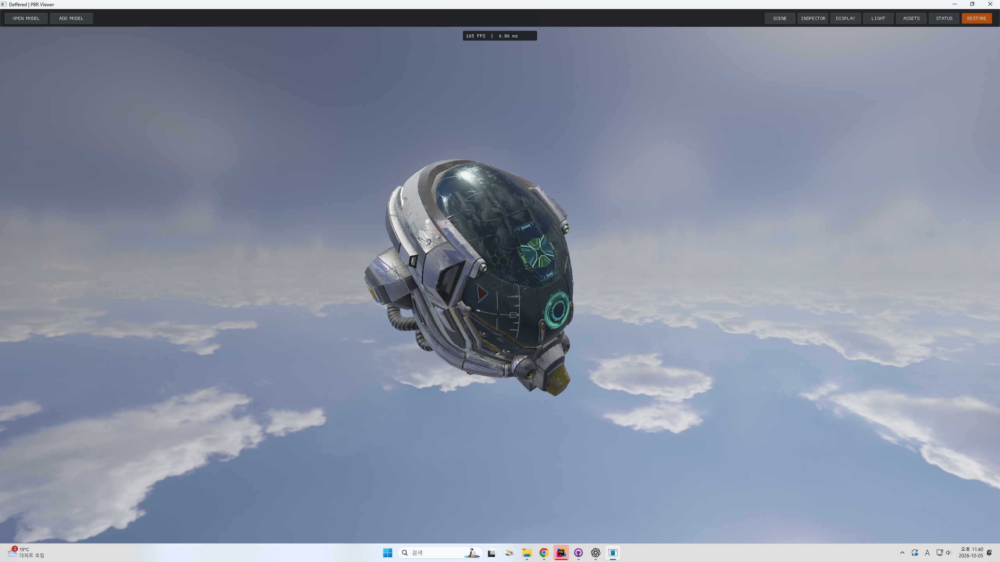
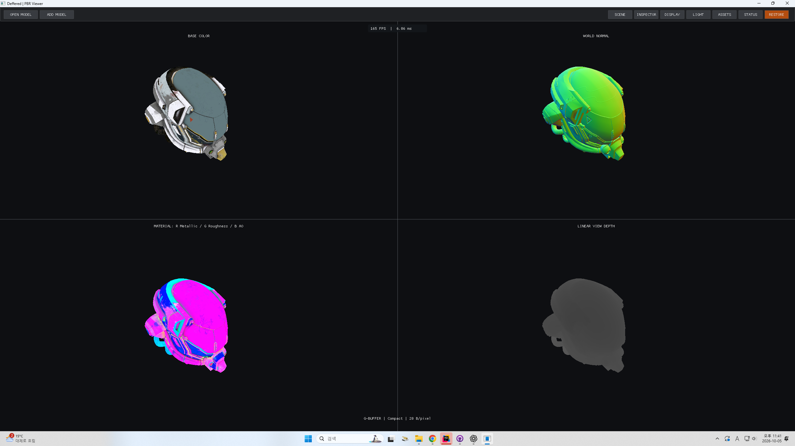

# D3D12 Deferred Renderer

C++20 / Direct3D 12 기반의 Windows용 PBR 메시 뷰어입니다.
졸업작품 **S.T.L의 Forward 렌더링 경험을 바탕으로, 표면 정보 생성과 조명 계산을 분리하는 Deferred 파이프라인을 구현**한 후속 프로젝트입니다.

실행 중 glTF 모델을 불러와 PBR·IBL 결과와 실제 G-buffer를 확인합니다.
중심 주제는 성능 우위 입증이 아니라 **렌더 패스 설계, 패스 간 GPU 리소스 관리, G-buffer 저장 구조와 위치 복원**입니다.
원본 S.T.L 게임 전체를 Deferred로 전환한 것은 아닙니다.

> 실행 프로젝트와 폴더는 기존 이름인 `Deffered`를 유지합니다. 렌더링 기법 명칭은 `Deferred`로 표기합니다.

## 실행 결과

### PBR · IBL 최종 렌더링



glTF 재질과 직접광·환경광을 합성한 결과입니다.
Damaged Helmet은 외부 샘플 에셋이며 직접 제작한 모델이 아닙니다.

### G-buffer 시각화



| 위치 | 표시 내용 |
| --- | --- |
| 좌상 | Base Color: 저장한 선형 색상을 표시용으로 변환 |
| 우상 | World Normal: Normal Map을 적용한 월드 공간 법선 |
| 좌하 | Material: R = Metallic, G = Roughness, B = AO |
| 우하 | Linear View Depth: 시점 깊이를 Range로 정규화한 값 |

원본 재질 텍스처 미리보기가 아니라 **Geometry Pass가 기록한 결과를 읽는 디버그 화면**입니다.
4분할은 표시 방식이며 실제 G-buffer는 Emissive를 포함한 **5개 색상 타깃**과 별도 Depth Buffer로 구성됩니다.
캡처의 FPS는 화면 상태 표시이며 성능 향상을 입증하는 측정 결과가 아닙니다.

## 핵심 구현

| 영역 | 내용 |
| --- | --- |
| Deferred | Geometry, Skybox, Lighting, UI 패스 분리 |
| G-buffer | Full 40B/pixel / Compact 20B/pixel 전환, 깊이 기반 월드 위치 복원 |
| PBR | GGX 분포, Schlick Fresnel, Smith Geometry, Metallic-Roughness 재질 |
| 환경광 | DDS Cubemap, SH Diffuse IBL, Prefiltered Specular IBL, BRDF LUT |
| Import | 런타임 glTF 선택·교체·추가, 다중 노드·primitive·불투명 재질 |
| Scene | 객체 선택·변환·표시·삭제, 객체별 재질 배율, 공유 리소스와 인스턴싱 |
| GPU 관리 | 명령 제출, Fence, 리소스 상태 전환, 업로드, 창 크기 변경 시 타깃 재생성 |
| 뷰어 | 자유 카메라·공전, 광원 조절, 표시 모드, 패널 토글 |

## 빌드와 실행

### 개발 환경

- Windows 및 Direct3D 12 지원 그래픽 환경
- C++20, MSVC `v145`, Windows SDK 10.0 계열
- Rider의 Visual Studio/MSBuild 도구 체인 또는 Visual Studio
- Dear ImGui는 저장소에 포함되어 있으며 별도 패키지 설치가 필요하지 않습니다.

`D3D12.slnx`를 열고 **Deffered / Release / x64**를 선택합니다.
Debug 구성은 오류 점검에 사용합니다. Developer PowerShell에서:

```powershell
msbuild .\D3D12.slnx /m /p:Configuration=Release /p:Platform=x64
& .\Deffered\bin\x64\Release\Deffered.exe
```

**일반 뷰어는 실행 인자 없이 시작합니다.**
Rider의 Program arguments에 예전 `--benchmark ...`가 남아 있다면 비웁니다.
시작 시 고정 모델은 없으며 빈 장면과 환경 배경이 표시됩니다.

1. `OPEN MODEL`로 `.gltf`를 선택하고 Import 창에서 Transform을 확인합니다.
2. 샘플은 `Asset/Mesh/DamagedHelmet/DamagedHelmet.gltf`를 사용할 수 있습니다.
3. `SCENE → FOCUS`로 선택 모델에 카메라를 맞춥니다.
4. `DISPLAY → LIT` 또는 `G-BUFFER OVERVIEW`로 결과를 확인합니다.

`OPEN MODEL`은 선택 객체를 교체하며 선택이 없으면 추가합니다.
`ADD MODEL`은 기존 객체를 유지하고 추가합니다. 취소·Import 실패 시 기존 모델을 유지합니다.

셰이더와 환경 DDS는 빌드 후 실행 폴더에 복사됩니다.
모델의 BIN·이미지는 선택한 glTF 파일의 상대 경로에서 읽습니다.
실행 파일은 프로젝트별 `bin/<Platform>/<Configuration>`에 생성되며 예전 루트 `x64`는 현재 실행 경로가 아닙니다.
셰이더는 런타임에 컴파일하므로 오류 발생 시 디버그 출력을 확인합니다.

## 렌더링 구조

```text
glTF Import → Scene / 공유 Model·Material·Texture
                         ↓
                  SceneRenderData
                         ↓
                  Geometry Pass
                         ↓
             G-buffer 5 MRT + Depth
                         ↓
             Deferred Lighting Pass ← 직접광 / IBL
                         ↓
            Skybox 배경 위에 표면 조명 합성
                         ↓
                   UI → Present
```

실제 프레임 실행 순서는 **Geometry → Skybox → Deferred Lighting → UI → Present**입니다.
Skybox는 Lit·Wireframe에서 설정에 따라 표시하며 디버그 모드는 표면 정보를 구분하기 위한 배경을 사용합니다.

| 구성 요소 | 책임 |
| --- | --- |
| `Renderer` | 초기화, 패스 실행 순서, 프레임 제출, 창 크기 변경과 종료 |
| `SceneRenderData` | 객체·재질 설정을 GPU 데이터와 Draw 목록으로 변환 |
| `GBufferRenderPass` | G-buffer 타깃·RTV·PSO, 메시 드로우와 상태 전환 |
| `SkyboxRenderPass` | 환경 배경과 환경 리소스 |
| `DeferredLightPass` | G-buffer·IBL SRV 연결과 전체 화면 조명 패스 |
| `ViewerUi` / `ViewerPanels` | ImGui 수명·입력 연결과 패널·위젯 |

Geometry Pass 전에 G-buffer를 `RENDER_TARGET`, 이후에는 `PIXEL_SHADER_RESOURCE`로 전환합니다.
Lighting Pass는 `Texture2D.Load`로 해당 픽셀의 표면 정보를 읽습니다.
창 크기 또는 G-buffer 레이아웃 변경 시 GPU 작업 완료를 기다리고 타깃과 관련 SRV를 다시 만듭니다.
UI 코드는 `UI` 폴더에 두고 렌더러는 변경된 설정을 GPU 작업에 연결합니다.

### G-buffer 저장 구조

| 데이터 | Full | Compact |
| --- | --- | --- |
| Base Color | `R8G8B8A8_UNORM` · 4B | 동일 · 4B |
| World Normal / 선택 마스크 | `R16G16B16A16_FLOAT` · 8B | `R10G10B10A2_UNORM` · 4B |
| Metallic / Roughness / AO / 유효 마스크 | `R8G8B8A8_UNORM` · 4B | 동일 · 4B |
| Emissive | `R16G16B16A16_FLOAT` · 8B | `R11G11B10_FLOAT` · 4B |
| 월드 위치 또는 깊이 | `R32G32B32A32_FLOAT` · 16B | `R32_FLOAT` · 4B |
| **색상 타깃 합계** | **40B/pixel** | **20B/pixel** |

깊이 판정용 `D32_FLOAT` Depth Buffer는 별도입니다.
Compact가 기본 설정이며 DISPLAY에서 Full로 전환할 수 있습니다.

Full은 월드 위치를 직접 저장합니다. Compact는 다섯 번째 색상 타깃에 `SV_POSITION.z`를 기록하고,
화면 좌표와 깊이를 역 View-Projection 행렬로 변환한 뒤 W로 나누어 월드 위치를 복원합니다.
깊이 판정용 DSV를 직접 샘플링하는 구현은 아닙니다.

**40B → 20B는 5개 색상 타깃의 픽셀당 데이터 용량 50% 감소**입니다.
Depth, 정렬·할당 오버헤드, 기타 리소스는 포함하지 않으며 전체 VRAM이나 GPU 시간의 50% 감소를 의미하지 않습니다.
작은 포맷은 정밀도 차이가 있으므로 모든 장면에서 Full/Compact의 화질 동등성을 보장하지 않습니다.

### PBR과 재질

직접광은 다음 구조로 계산하고 환경광·발광을 합성합니다.

```text
specular = (D * F * G) / (4 * NdotL * NdotV)
diffuse  = (1 - F) * (1 - metallic) * albedo / PI
direct   = (diffuse + specular) * radiance * NdotL
```

glTF Metallic-Roughness 텍스처는 G = Roughness, B = Metallic을 사용하고
AO는 `occlusionTexture`가 참조하는 이미지의 R을 사용합니다.
입력 텍스처의 채널 배치와 G-buffer의 M/R/AO 패킹은 다릅니다.

Base Color·Emissive 색상 텍스처와 Normal·재질 데이터 텍스처의 색상 처리를 구분합니다.
Normal은 TBN으로 변환하며 CPU 행 벡터·HLSL `row_major` 규약을 사용합니다.
Tone Mapping과 Gamma 처리는 조명 셰이더에서 수행합니다.

## 조작과 UI

| 입력 / 패널 | 동작 |
| --- | --- |
| W/S, A/D, Q/E | 자유 카메라 전후·좌우·상하 이동 |
| 우클릭 + 마우스 이동 | 마우스 중앙 고정 상태에서 카메라 회전 |
| R | 선택 메시 중심 자동 공전 토글 |
| 공전 중 W/S | 모델과의 거리 조절 |
| 공전 중 Q/E | 모델을 바라보는 고도 조절, 최대 ±45도 |
| L | Directional Light 회전 토글 |
| 숫자 1 | 창 모드 / 전체화면 전환 |
| SCENE | 객체 선택·표시, FOCUS, DELETE |
| INSPECTOR | Transform, 재질 선택과 객체별 재질 배율 |
| DISPLAY | Lit, Base Color, Normal, Metallic, Roughness, AO, Emissive, Depth, Wireframe, G-buffer Overview |
| DISPLAY의 레이아웃 선택 | Full 40B / Compact 20B 전환 |
| LIGHT | 방향, 색상, 강도, 환경 강도, 노출, 광원 회전 |
| ASSETS | 모델 정보와 원본 재질 텍스처 미리보기 |
| HIDE ALL / RESTORE | 패널 숨김과 복원 |

Inspector와 Assets는 기본으로 닫혀 있으며 상단 버튼으로 열 수 있습니다.
UI 조작 중에는 카메라 입력 충돌을 방지합니다.
일반 표시 모드에서는 마우스로 객체를 선택할 수 있지만 4분할 Overview에서는 뷰포트 클릭 선택을 하지 않습니다.
디버그 표시에는 선택 테두리를 넣지 않으며 Depth·Overview의 `Range`로 깊이 표시 범위를 조절합니다.

## Import와 리소스

- `.gltf` JSON, 외부 로컬 BIN·이미지, 다중 노드·primitive·불투명 재질을 지원합니다.
- accessor offset·stride, 8/16/32-bit 인덱스, 노드 matrix/TRS와 좌표계 변환을 처리합니다.
- NORMAL 또는 TANGENT가 없으면 지원되는 입력에서 데이터를 생성합니다.
- 동일 모델·이미지는 경로 기반 캐시로 공유하고 객체별 Transform·재질 배율은 독립적으로 유지합니다.
- Import 후보의 업로드가 끝난 뒤 Scene에 반영하므로 실패한 입력이 기존 객체를 덮어쓰지 않습니다.
- 현재 Import는 동기 방식이며 큰 파일을 읽을 때 UI가 일시적으로 멈출 수 있습니다.

GLB, data URI·내장 이미지, sparse accessor, 스킨·애니메이션, 압축 메시,
Alpha MASK/BLEND, 추가 UV 세트와 Texture Transform 등은 현재 지원 범위 밖입니다.
재질 텍스처의 샘플러·mip 처리도 glTF의 모든 설정을 재현하지 않습니다.

## 폴더 구조

```text
D3D12.slnx
README.md                     # 현재 구현과 실행 안내
Capture/                      # Lit / G-buffer 포트폴리오 캡처
Asset/                        # 공유 glTF·텍스처·환경 DDS
Deffered/                     # 주 개발 프로젝트
  Core/                       # 진입점
  Common/                     # PCH, 자체 Math, D3D12 보조 구조체
  Renderer/
    Renderer.*                # 초기화와 패스 조립
    SceneRenderData.*         # Draw·인스턴스·상수 데이터
    Manager/                  # Camera, Input, Light, Resource 관리
    Pass/                     # GBuffer, Skybox, DeferredLight
    Shader/                   # PBR·G-buffer·조명·디버그 HLSL
  Resource/                   # glTF 파싱, 메시·재질·텍스처와 캐시
  Scene/                      # 객체·선택·변환
  UI/                         # 패널, 파일 선택, Import 대화상자
  ThirdParty/ImGui/           # Dear ImGui와 백엔드
Forward/                      # S.T.L 참조 Forward 포팅본
Benchmark/                    # 보관 중인 비교 설정·계측·실행 스크립트
Tests/                        # Import·배칭 검증 코드
Base_MD/                      # 기존 설계·계획·개발 기록
```

Camera·Input·Light·Shader 관리는 기존 싱글턴 구조를 사용합니다.
ResourceManager는 Renderer 소유 객체이며 GPU 장치와 리소스의 수명을 함께 관리합니다.
기존 `MeshRenderPass`는 소스에 남아 있지만 기본 Deferred 경로에서 호출하지 않습니다.

## 포트폴리오 시연

설명 주제는 **“Forward 경험에서 Deferred 구조로 확장하며 무엇을 구현하고 학습했는가”**입니다.
인스턴싱은 기존 기능이므로 이번 확장의 새로운 성과로 내세우지 않습니다.

1. Damaged Helmet을 Import하고 FOCUS 또는 자유 카메라로 구도를 맞춥니다.
2. 카메라 공전과 광원 회전을 정지하고 창 크기를 고정합니다.
3. Lit에서 선택을 해제하고 패널을 숨겨 최종 결과를 캡처합니다.
4. 같은 카메라에서 G-BUFFER OVERVIEW로 전환하고 Range를 조절한 뒤 캡처합니다.
5. 두 이미지 사이에 `Geometry → G-buffer → Lighting` 흐름과 구현 내용을 배치합니다.

강조할 내용은 패스 간 데이터 전달, 명시적 상태 전환, 위치 복원과 저장 포맷 선택입니다.
FPS 비교나 “Deferred가 항상 빠르다”는 주장 대신 구현 범위와 저장 비용의 의미를 설명합니다.

## 비교 실험과 검증 범위

Forward와 Benchmark는 후속 성능 점검을 위해 보관하며 **기본 시연에는 사용하지 않습니다.**
Forward는 S.T.L 전체 게임의 무수정 복사본이 아니라 정적 메시 렌더링 포팅본입니다.
[포팅 범위와 차이](Forward/PipReference/PORTING_NOTES.md)를 참고합니다.

기존 JSON 기반 비교가 필요할 때만 저장소 루트에서 명시적으로 실행합니다.

```powershell
& .\Deffered\bin\x64\Release\Deffered.exe --benchmark .\Benchmark\comparison.json
```

계측에는 CPU 준비·기록 시간, GPU 타임스탬프, Draw·SRV 쓰기 횟수와 CSV/JSON 출력이 포함됩니다.
비교 모드에서는 컬링을 제외한 조건을 사용합니다.
과거 실행 결과는 해당 장면·설정에 한정되며 원본 S.T.L 대비 성능 개선이나 모든 장면에서의 우위를 의미하지 않습니다.

확인 기록:

- 2026-10-05: 두 프로젝트 Debug/Release x64 빌드, Deferred 및 G-buffer 관련 셰이더 컴파일 통과.
- 사용자가 촬영한 `Capture`의 Lit·Compact Overview 화면 확인.
- 캡처 확인은 모든 Import 입력, GPU, 창 크기에서의 정확성 검증을 대신하지 않습니다.

수동 점검은 Import 취소·실패 시 기존 객체 유지, 동일 모델 추가와 개별 편집,
Full/Compact 전환, 창 크기 변경·전체화면, Debug Layer 오류 확인 순서로 진행합니다.
`Tests`의 회귀 테스트와 실행 화면 검증은 구분합니다.
이 README 정리 작업에서는 빌드·테스트를 다시 실행하지 않았습니다.

### 남은 범위

- 투명 재질, 그림자, 일반 뷰어의 Point/Spot Light 편집
- 별도 HDR 조명 타깃과 후처리, 색상 공간·정밀도 검증 확대
- 환경맵 변경에 대응하는 SH·IBL 전처리
- 비동기 Import, 추가 glTF 구조와 확장 지원
- Device Lost 복구와 자동 GPU 검증 확대

비교 경로의 Point Light 실험과 일반 뷰어의 광원 편집 기능은 별개입니다.
Tiled/Clustered Deferred나 완성된 상용 게임 엔진을 구현한 것으로 설명하지 않습니다.

## 코드 컨벤션

- 클래스 이름은 대문자: `RENDERER`, `CAMERA_MANAGER`.
- 일반 변수는 소문자, 복합어는 `snake_case`.
- bool 변수는 `is` 접두사 사용. `is` 바로 뒤에 밑줄을 붙이지 않음: `iscompact`.
- 멤버 변수는 `_` 접두사 사용: `_device`, `_iscompact`.
- 함수는 소문자, 복합어는 밑줄로 구분: `create_pipeline`, `render_frame`.
- Manager 파일 이름은 `Manager` 접미사 사용: `CameraManager.h`.
- 공통 include와 반복 namespace는 `stdafx.h`, 기본 수학은 `Common/Math.h`에 정리.
- C++ 소스의 첫 PCH include는 해당 파일의 프로젝트 PCH 설정과 일치시킴.
- 외부 라이브러리 소스는 원래 컨벤션을 유지. 기존 코드의 불일치는 별도 정리 대상으로 구분.

## 참고와 설계 기록

PBRT는 반사 모델과 빛의 수송을 이해하기 위한 참고 자료입니다.
실시간 Deferred 패스 구성이나 Split-Sum IBL 전체를 PBRT에서 그대로 이식했다는 의미는 아닙니다.

| 참고 | 관련 내용 |
| --- | --- |
| [PBRT 4판](https://www.pbr-book.org/4ed/contents) | PBR 이론과 재질·광원 개념 |
| [Microfacet Theory](https://www.pbr-book.org/4ed/Reflection_Models/Roughness_Using_Microfacet_Theory) | 거칠기, 법선 분포와 Masking |
| [Infinite Area Lights](https://www.pbr-book.org/4ed/Light_Sources/Infinite_Area_Lights) | 환경광의 개념 |
| [glTF 2.0 규약](https://registry.khronos.org/glTF/specs/2.0/glTF-2.0.html) | 노드·메시·재질·텍스처 데이터 규약 |
| [D3D12 Resource Barriers](https://learn.microsoft.com/en-us/windows/win32/direct3d12/using-resource-barriers-to-synchronize-resource-states-in-direct3d-12) | 명시적 리소스 상태 전환 |
| [HLSL Texture Load](https://learn.microsoft.com/en-us/windows/win32/direct3dhlsl/dx-graphics-hlsl-to-load) | 정수 텍셀 좌표로 G-buffer 읽기 |

기존 문서는 설계·실험 이력이며 현재 구현과 다른 계획이 포함될 수 있습니다.
현재 실행 방법과 프로젝트 방향은 이 README를 기준으로 합니다.

- [기존 성능 비교 계획](Base_MD/docs/RENDERER_BENCHMARK_PLAN.md): 보조 실험 기록, 현재 주 개발 목표 아님.
- [엔진 목표와 범위](Base_MD/GDD/Game_GDD.md)
- [구현 마일스톤](Base_MD/GDD/Implemention_Plan.md)
- [계획 아키텍처](Base_MD/docs/ARCHITECTURE.md)
- [기존 진행 계획](Base_MD/docs/PLANS.md)
- [설계 결정](Base_MD/docs/DECISIONS.md)

루트의 기능별 안내는 이 README에 통합하고 별도 MD를 늘리지 않습니다.
